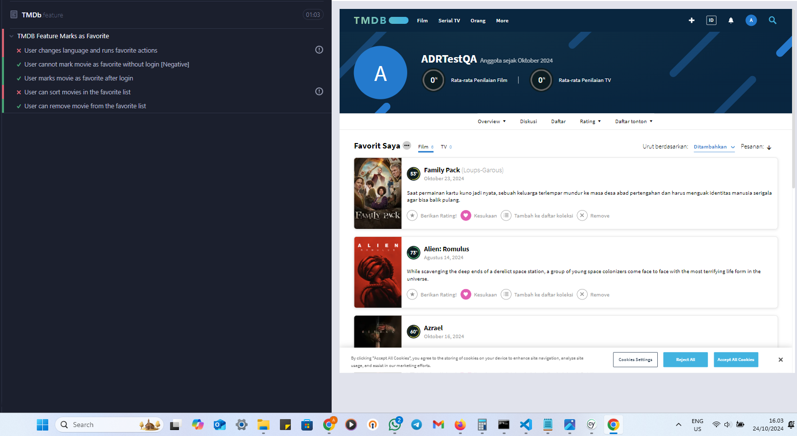
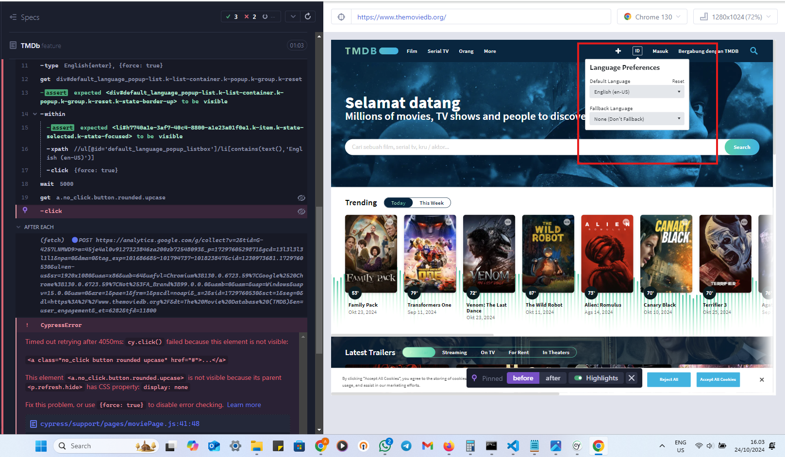
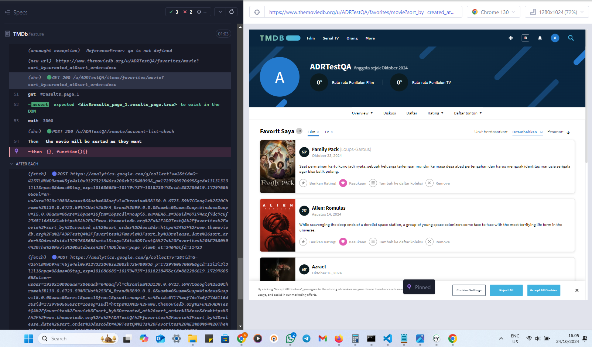
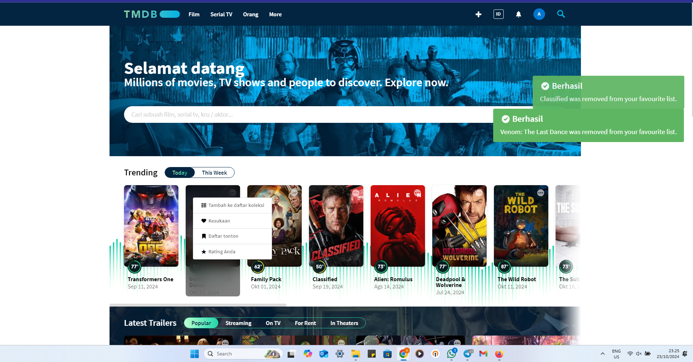
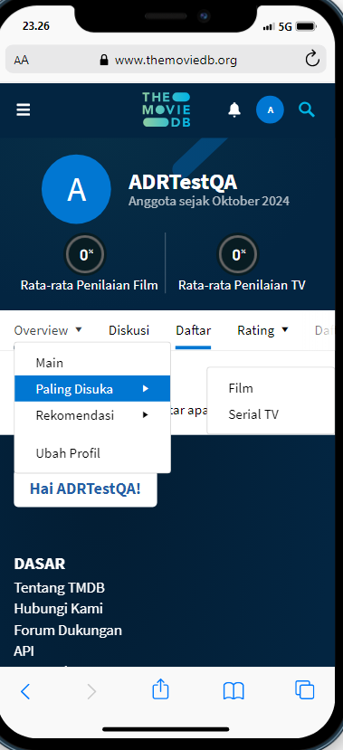
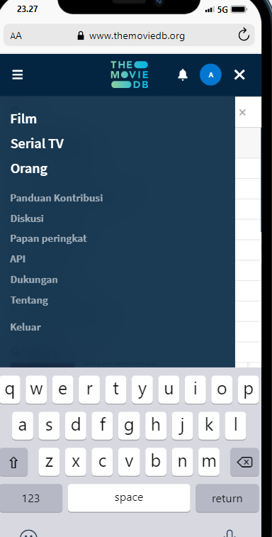

# TMDB-QA-Testing
Repository ini digunakan untuk pengujian manual pada website [The Movie Database (TMDB)](https://www.themoviedb.org).

# Manual Testing Web TMDB

Test case, bug report, dan test report dapat diakses melalui link berikut:  
[Google Spreadsheet - TMDB Testing](https://docs.google.com/spreadsheets/d/1gccDyNH5z10r6LChsOeaRbHhPmGV0qrwgtctzPtbu4U/edit?usp=sharing)

### Penjelasan Umum

Pengujian manual terhadap website TMDB melibatkan 13 test case yang mencakup berbagai fitur seperti registrasi, login, perubahan bahasa, pengelolaan film favorit, dan logout. Pengujian ini bertujuan untuk memastikan bahwa fitur-fitur tersebut berfungsi dengan baik sesuai ekspektasi. Pada fitur registrasi dan login, pengujian memastikan pengguna dapat mendaftar dengan data yang valid serta melakukan verifikasi email, sementara fitur login diuji untuk memeriksa validasi data login. Fitur perubahan bahasa diuji untuk memastikan seluruh situs dapat beralih ke Bahasa Indonesia secara penuh. Selain itu, pengelolaan film favorit diuji dalam kondisi login dan non-login, mencakup penandaan, penghapusan, serta pengurutan film favorit dalam dua bahasa, dan fitur logout diuji untuk memastikan proses keluar berjalan lancar.

Dari pengujian ini, ditemukan 5 bug yang memengaruhi beberapa fitur. Bug pertama terkait dengan terjemahan situs yang tidak sepenuhnya menggunakan Bahasa Indonesia setelah perubahan bahasa. Bug kedua adalah fitur terjemahan yang tidak berfungsi sepenuhnya, sehingga beberapa bagian situs tetap dalam Bahasa Inggris. Pengelolaan film favorit juga menemui masalah, di mana pengguna tidak dapat menghapus film dari daftar favorit secara langsung melalui halaman favorit. Selain itu, terdapat bug pada pesan tooltip ikon favorit yang tidak berubah setelah tindakan pengguna. Bug terakhir serupa dengan penghapusan film dari daftar favorit yang gagal, menyebabkan kesulitan dalam pengelolaan daftar favorit secara efektif.

# Automate Testing for TMDB

Terdapat beberapa error pada fitur ganti bahasa dan sorting. Berikut ini adalah detail skenario pengujian menggunakan Gherkin serta implementasi otomatisasi pengujian menggunakan Cypress.

## Feature: TMDB Feature Marks as Favorite

#### Scenario 1: User changes language and runs favorite actions (Regression Test)
```gherkin
@regression
Scenario: User changes language and runs favorite actions
    Given the user is on the homepage without login
    When the user changes language to "English"
    Then the page should display in "English"
    When the user changes language to "Indonesian"
    Then the page should display in "Indonesian"
```

#### Scenario 2: User cannot mark movie as favorite without login [Negative Test]
```gherkin
@regression 
Scenario: User cannot mark movie as favorite without login [Negative]
    Given the user is on the homepage without login
    When the user selects a movie "Alien: Romulus"
    And the user clicks the favorite button
    Then the user should not be redirected to the login page
    And the user should remain on the movie page
```

#### Scenario 3: User marks movie as favorite after login
```gherkin
@regression 
Scenario: User marks movie as favorite after login
    Given the user is on the login page
    When the user logs in with valid credentials
    And the user navigates to the homepage
    And the user selects a movie "Family Pack"
    And the user clicks the favorite button
    And the movie should be added to the user's favorite list
```

#### Scenario 4: User can sort movies in the favorite list
```gherkin
@regression
Scenario: User can sort movies in the favorite list
  Given the user is on the login page
  When the user logs in with valid credentials
  And the user has marked some movies as favorites
  And the user sorts the movies in their favorite list
  Then the movie will be sorted as they want
```

#### Scenario 5: User can remove movie from the favorite list
```gherkin
@regression
Scenario: User can remove movie from the favorite list
    Given the user is on the login page
    When the user logs in with valid credentials
    And the user has marked some movies as favorites
    When the user removes the movie "Family Pack" from favorites
    Then the movie should no longer be in the user's favorite list
```

## Tools and Libraries Used:
- **Cypress**: `^13.15.0`
- **Cucumber Version**: `4.3.1`
- **Node.js Version**: `19.4`
- **XPath**: `2.0.3`

## Test Validation Strategy:

### Scenario 1: Verifying language switch functionality
```javascript
verifyLanguage(language) {
    cy.contains(
      "h2",
      language === "Indonesian" ? "Selamat datang" : "Welcome"
    ).should("be.visible");
}
```

### Scenario 2: Ensuring user remains on the movie page when not logged in
```javascript
cy.url().should("include", "/movie"); // URL must remain on the movie page
```

### Scenario 3: Verifying movie is added to the favorites list after login
```javascript
verifyMovieInFavorites(movieTitle) {
    cy.scrollTo("top");
    cy.get(".no_click > .avatar").click(); // Correct selector
    cy.get(".k-tooltip-content > .settings_content > :nth-child(1) > p > a").click({ force: true });
    cy.wait(2000);
    cy.get("li.k-item span.k-link").contains("Overview").click();
    cy.get("ul.k-group.k-menu-group")
      .should("be.visible")
      .find("a.k-link.k-menu-link")
      .contains("Film")
      .click({ force: true });
    cy.get("h2")
      .contains("Family Pack")
      .parent()
      .within(() => {
        cy.get("span.title").contains("(Loups-Garous)").should("be.visible");
      });
}
```

### Scenario 4: Verifying sorting functionality of favorite movies
```javascript
verifySortedMovies() {
    cy.get("#results_page_1").should("exist"); // Ensure results are displayed after sorting
}
```

### Scenario 5: Ensuring the movie is removed from the favorites list
```javascript
verifyMovieNotInFavorites(movieTitle) {
    cy.visit("https://www.themoviedb.org/u/ADRTestQA/favorites");
    cy.contains("h2", movieTitle).should("not.exist");
}
```
## Hasil Automate Testing

### 3 dari 5 Scenario Berhasil


**Scenario yang Berhasil:**
1. User tidak bisa memberikan favorite saat belum login.
2. User bisa memberikan favorite saat login.
3. User bisa menghapus film dari daftar favorite.

---

### Pengujian Automate Gagal pada Fitur Ganti Bahasa


**Deskripsi Masalah:**  
Pengujian untuk fitur ganti bahasa gagal karena tombol untuk reload page tidak muncul.

---

### Pengujian Automate Gagal pada Sorting Favorite List


**Deskripsi Masalah:**  
Pengujian sorting pada daftar favorite gagal karena elemen yang diperlukan tidak muncul.

---


## Feedback untuk Tim UI/UX dan Pengembangan:
- **UI/UX**: Hindari penggunaan menu dropdown yang berlebihan, karena akan menghambat pengalaman pengguna dan mempersulit pengujian QA.
- **Feedback Pengembang**:
- Ditemukan bug saat menghapus film langsung dari daftar favorit.
- Bug notifikasi bertumpuk saat menambahkan favorit.
- Bug dropdown pada ukuran layar kecil yang menyebabkan masalah pemisahan tata letak.

## Masalah yang Perlu Diperhatikan oleh UI/UX dan Developer

### Notifikasi Bertumpuk Saat Menambahkan Favorite


**Deskripsi Masalah:**  
Pada saat user menambahkan item ke favorite, terdapat bug di mana notifikasi bertumpuk muncul.

---

### Bug pada Dropdown di Layar Kecil


**Deskripsi Masalah:**  
Dropdown mengalami masalah dan tidak berfungsi dengan baik pada layar kecil.

---

### Bug pada Sidebar di Layar Kecil


**Deskripsi Masalah:**  
Sidebar mengalami bug dan tampil tidak sesuai saat dilihat pada layar kecil.

---


## Yang Sudah Dikerjakan

1. **Manual Testing**
2. **Automate Testing dengan Cypress**
3. **Validasi setiap step dan hasil dari pengujian**
4. **Menggunakan Git dan GitHub**
5. **Menuliskan skenario pengujian**

